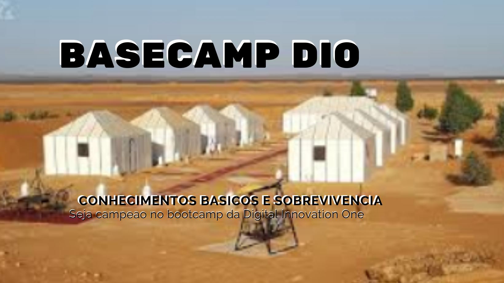

<!-- PROJECT SHIELDS -->

[![Contributors][contributors-shield]][contributors-url]
[![Forks][forks-shield]][forks-url]
[![Stargazers][stars-shield]][stars-url]
[![Issues][issues-shield]][issues-url]
[![MIT License][license-shield]][license-url]
[![LinkedIn][linkedin-shield]][linkedin-url]

<!-- PROJECT LOGO -->

# Projeto DIO   

## ProjetoDIO :  BASECAMP  

Acompanhando atentamente o Forum da Comunidade, ajudando a padawan, descobri uma serie de Duvidas Comuns a nossa comunidade.

Num trabalho de formiguinha, procuro auxiliar no Onboarding, capturando estas questoes e explanando em Artigos no Forum da Comunidade.

Esse pequeno Walktrought tem como missao, ajudar e evitar a desistencia de padawans por desconhecimento das funcionalidades e desencanto com a Plataforma.

Minha meta é ajudar os iniciantes oriundos dos mais diversos meios e com pouco conhecimento em informatica.

Projeto open-source, es livre para participar e incluir comentário.

 Fork o projeto

Nao esqueça da estrelinha.

Obrigado

[Basecamp DIO](WorkInProgress)

---

#### * DIO - Digital Inovation One *
######  [Inscreva-se na Dio](https://digitalinnovation.one/sign-up?ref=R5J3ZLTIFS)  

######  [Vagner Bellacosa perfil na Dio](https://web.dio.me/users/vagnerbellacosa?tab=achievements)  

<!-- MARKDOWN LINKS & IMAGES -->
<!-- https://www.markdownguide.org/basic-syntax/#reference-style-links -->
[contributors-shield]: https://img.shields.io/github/contributors/VagnerBellacosa/ProjetoDIO_BASECAMP.svg?style=for-the-badge
[contributors-url]: https://github.com/VagnerBellacosa/ProjetoDIO_BASECAMP/graphs/contributors
[forks-shield]: https://img.shields.io/github/forks/VagnerBellacosa/ProjetoDIO_BASECAMP.svg?style=for-the-badge
[forks-url]: https://github.com/VagnerBellacosa/ProjetoDIO_BASECAMP/network/members
[stars-shield]: https://img.shields.io/github/stars/VagnerBellacosa/ProjetoDIO_BASECAMP.svg?style=for-the-badge
[stars-url]: https://github.com/VagnerBellacosa/ProjetoDIO_BASECAMP/stargazers
[issues-shield]: https://img.shields.io/github/issues/VagnerBellacosa/ProjetoDIO_BASECAMP.svg?style=for-the-badge
[issues-url]: https://github.com/VagnerBellacosa/ProjetoDIO_BASECAMP/issues
[license-shield]: https://img.shields.io/github/license/VagnerBellacosa/ProjetoDIO_BASECAMP.svg?style=for-the-badge
[license-url]: https://github.com/VagnerBellacosa/ProjetoDIO_BASECAMP/blob/master/LICENSE.txt
[linkedin-shield]: https://img.shields.io/badge/-LinkedIn-black.svg?style=for-the-badge&logo=linkedin&colorB=555
[linkedin-url]: https://www.linkedin.com/in/VagnerBellacosa/
[product-screenshot]: WorkInProgress/Image/BaseCampDIO.png  